# Summary of 3_Linear

[<< Go back](../README.md)

## Logistic Regression (Linear)
- **n_jobs**: -1
- **explain_level**: 2

## Validation
 - **validation_type**: split
 - **train_ratio**: 0.75
 - **shuffle**: True
 - **stratify**: True

## Optimized metric
auc

## Training time

3.3 seconds

## Metric details
|           |    score |   threshold |
|:----------|---------:|------------:|
| logloss   | 0.334924 | nan         |
| auc       | 0.931818 | nan         |
| f1        | 0.872727 |   0.591134  |
| accuracy  | 0.885246 |   0.591134  |
| precision | 1        |   0.846318  |
| recall    | 1        |   0.0133119 |
| mcc       | 0.776719 |   0.738523  |

## Metric details with threshold from accuracy metric
|           |    score |   threshold |
|:----------|---------:|------------:|
| logloss   | 0.334924 |  nan        |
| auc       | 0.931818 |  nan        |
| f1        | 0.872727 |    0.591134 |
| accuracy  | 0.885246 |    0.591134 |
| precision | 0.888889 |    0.591134 |
| recall    | 0.857143 |    0.591134 |
| mcc       | 0.768734 |    0.591134 |

## Confusion matrix (at threshold=0.591134)
|              |   Predicted as 0 |   Predicted as 1 |
|:-------------|-----------------:|-----------------:|
| Labeled as 0 |               30 |                3 |
| Labeled as 1 |                4 |               24 |

## Learning curves
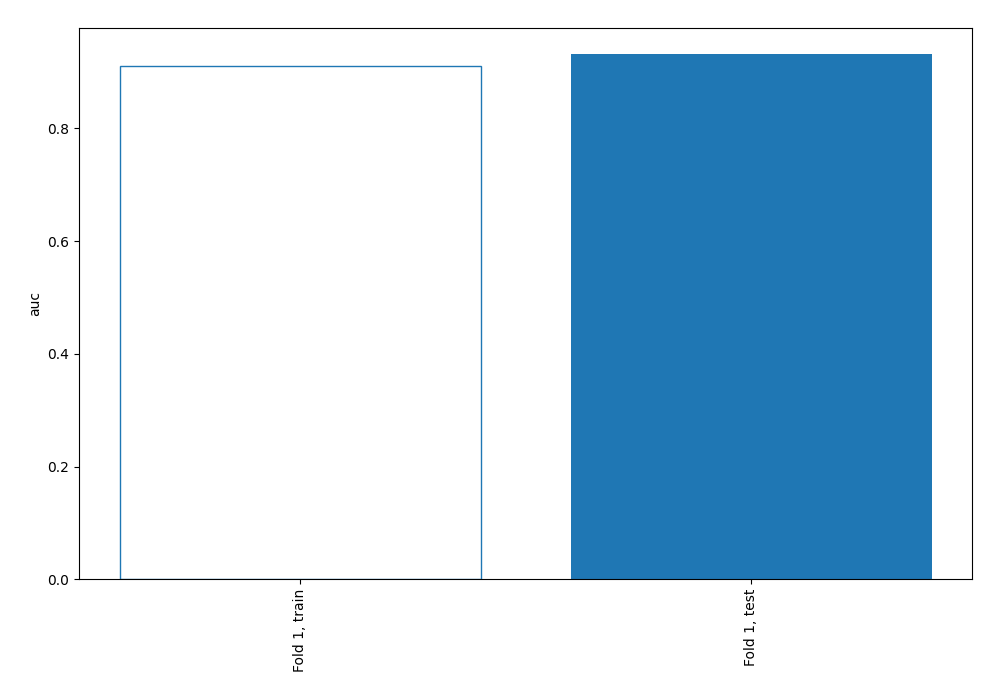

## Coefficients
| feature   |   Learner_1 |
|:----------|------------:|
| ca        |   1.0175    |
| sex       |   0.711283  |
| cp        |   0.605118  |
| thal      |   0.546046  |
| chol      |   0.46079   |
| slope     |   0.24261   |
| exang     |   0.242417  |
| restecg   |   0.198602  |
| trestbps  |   0.147938  |
| oldpeak   |   0.143452  |
| intercept |   0.0215842 |
| age       |  -0.0101871 |
| fbs       |  -0.167585  |
| thalach   |  -0.495158  |

## Permutation-based Importance
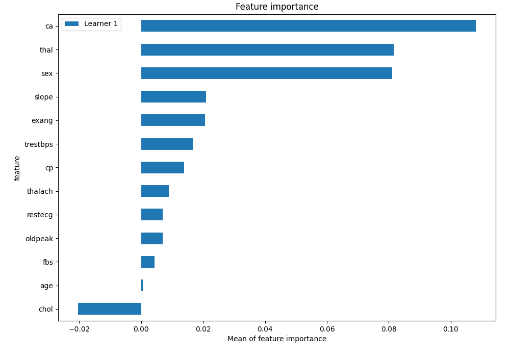
## Confusion Matrix

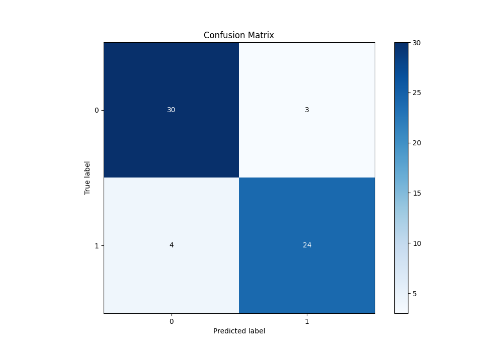

## Normalized Confusion Matrix

## ROC Curve

## Kolmogorov-Smirnov Statistic

## Precision-Recall Curve

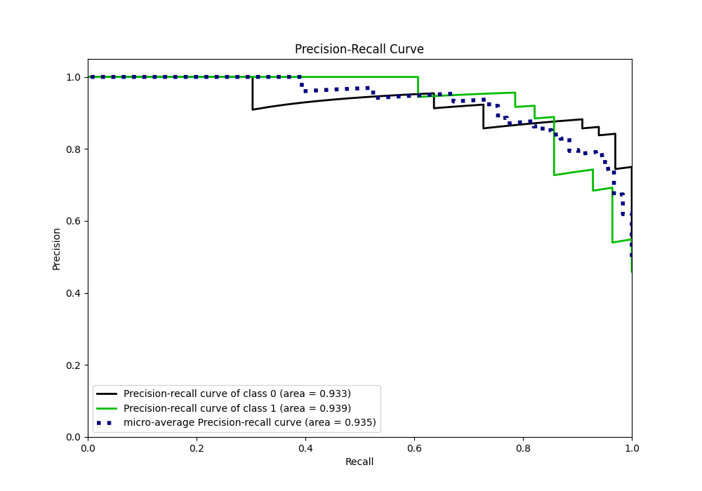

## Calibration Curve

## Cumulative Gains Curve

## Lift Curve

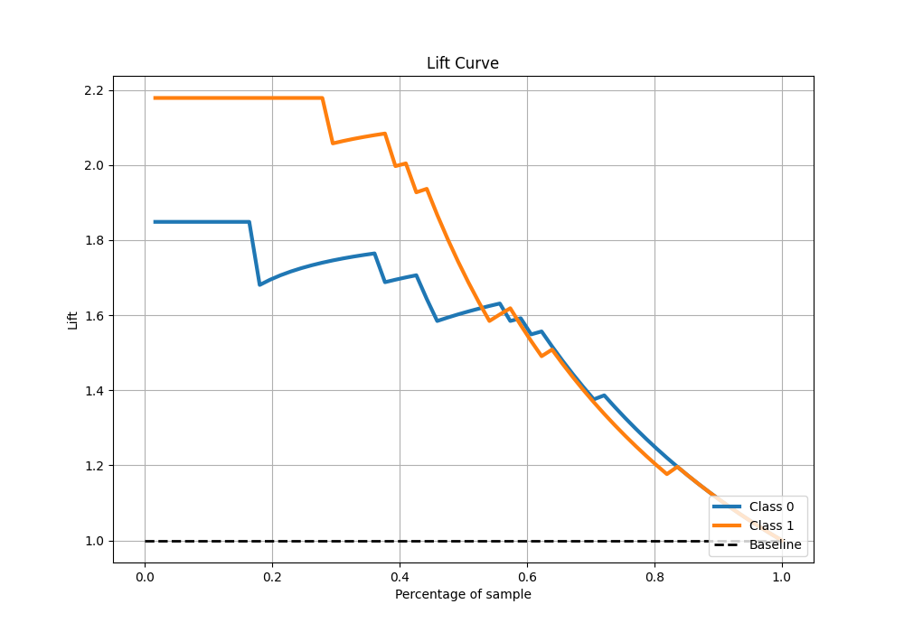

## SHAP Importance
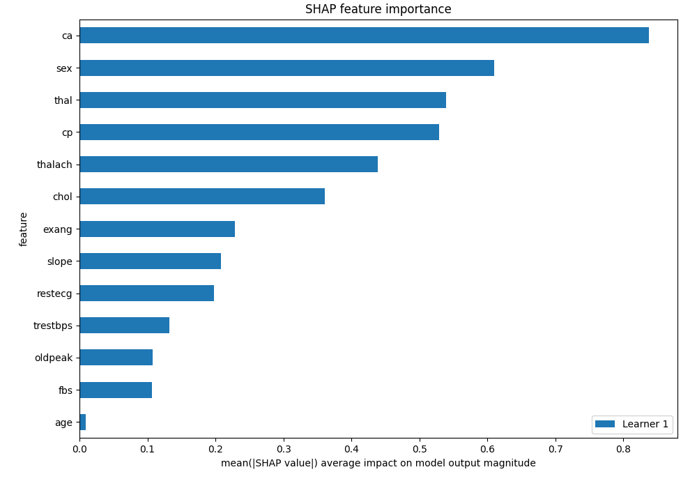

## SHAP Dependence plots

### Dependence (Fold 1)
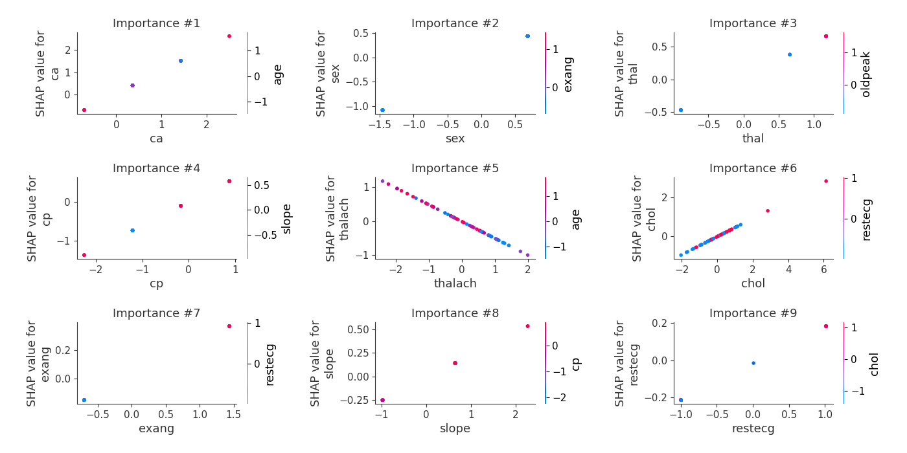

## SHAP Decision plots

### Top-10 Worst decisions for class 0 (Fold 1)
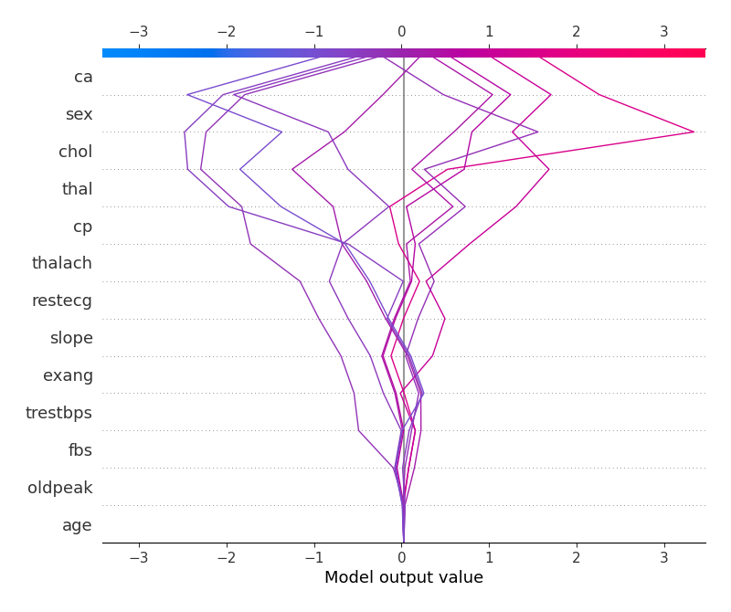
### Top-10 Best decisions for class 0 (Fold 1)
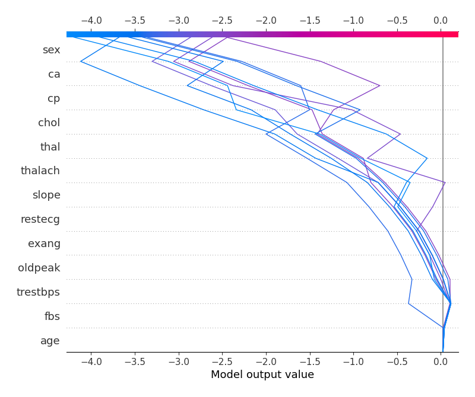
### Top-10 Worst decisions for class 1 (Fold 1)
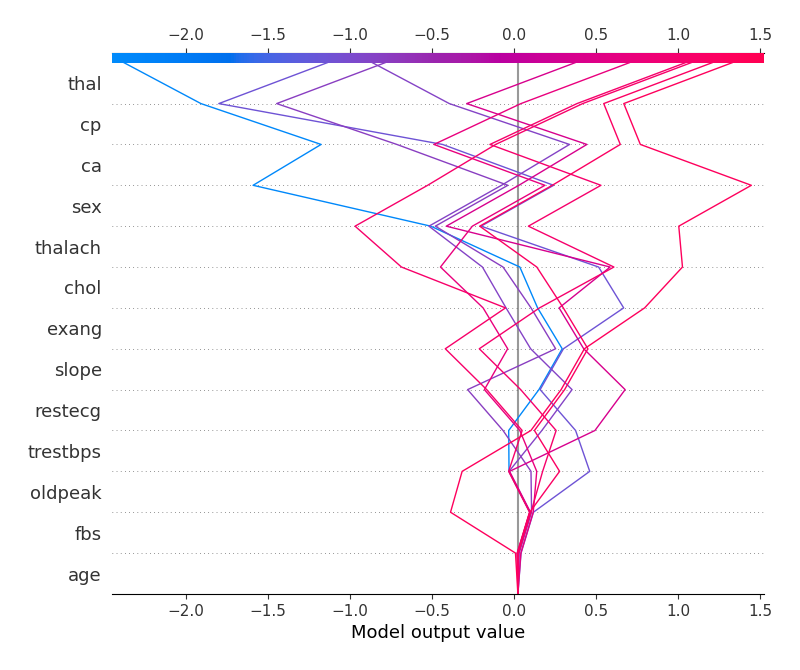
### Top-10 Best decisions for class 1 (Fold 1)
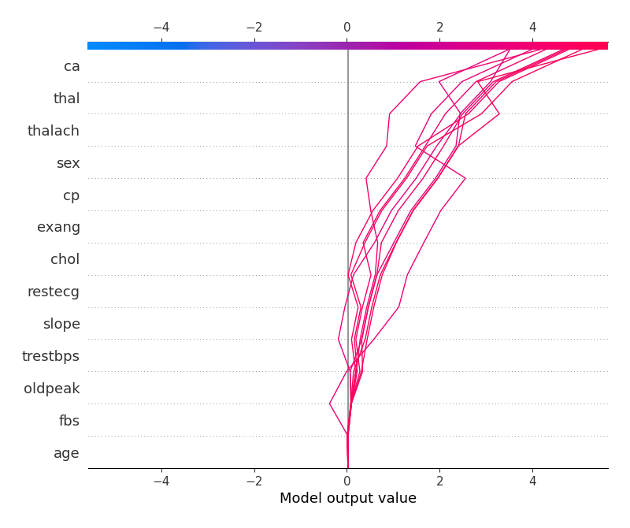

[<< Go back](../README.md)
