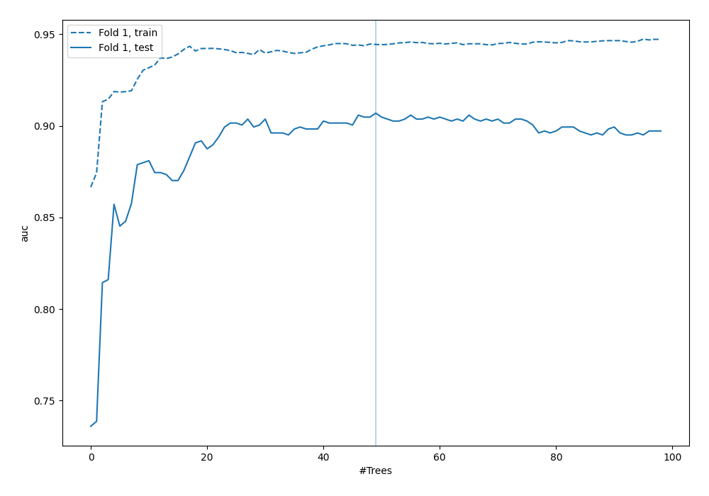
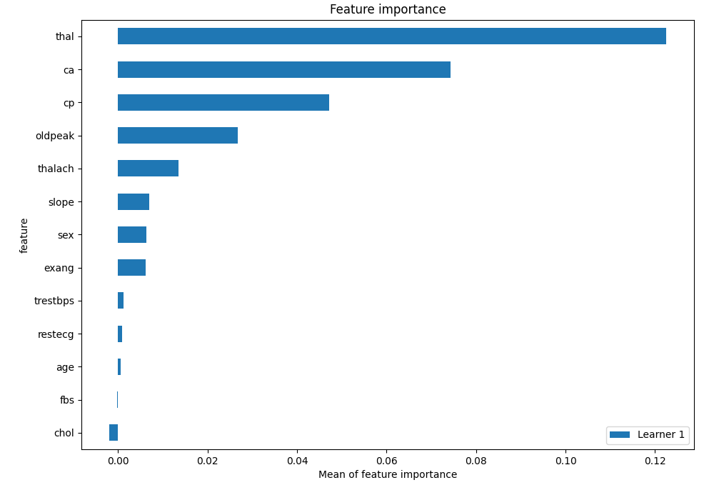
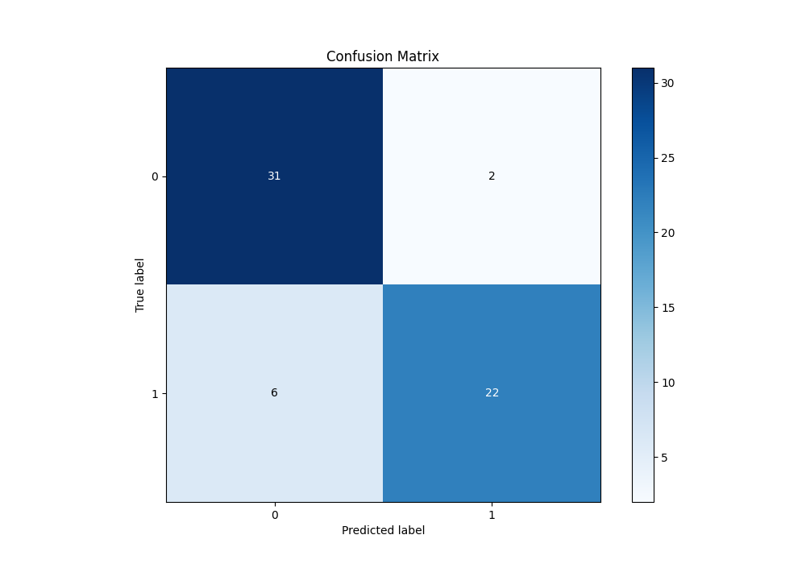
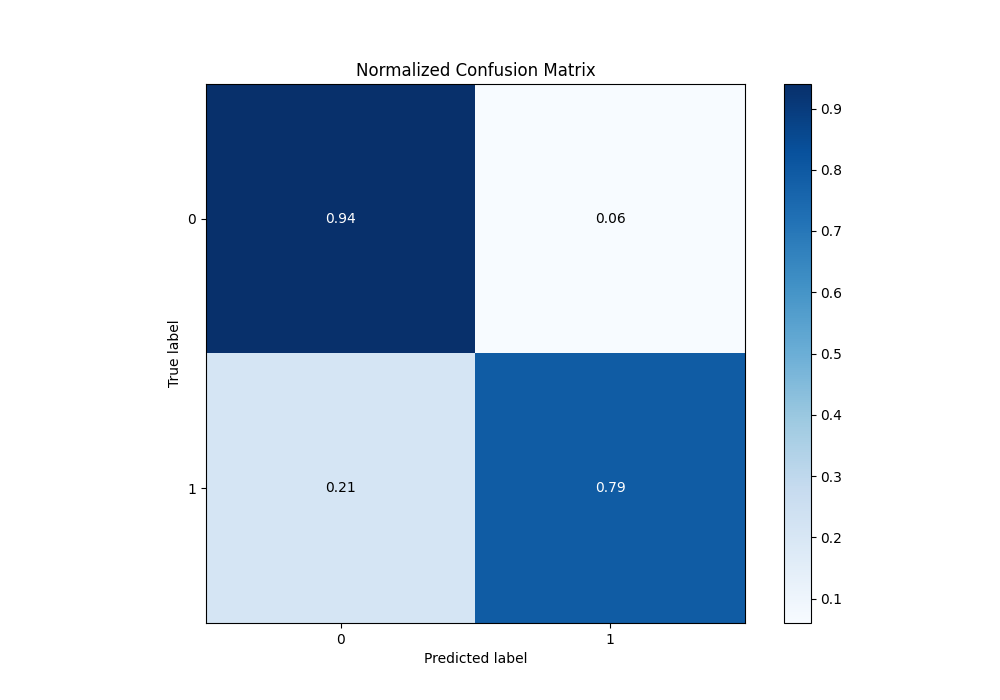
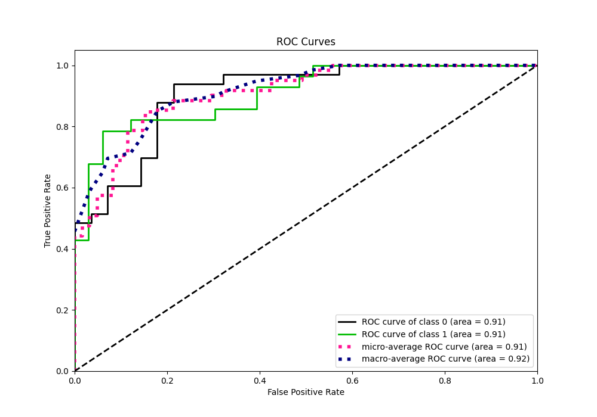
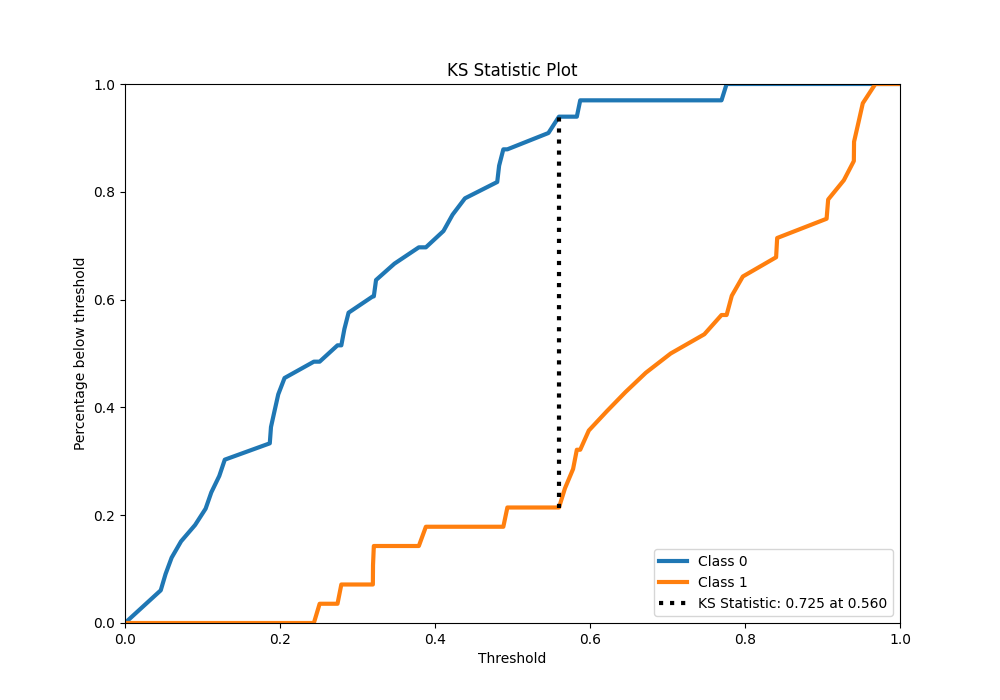
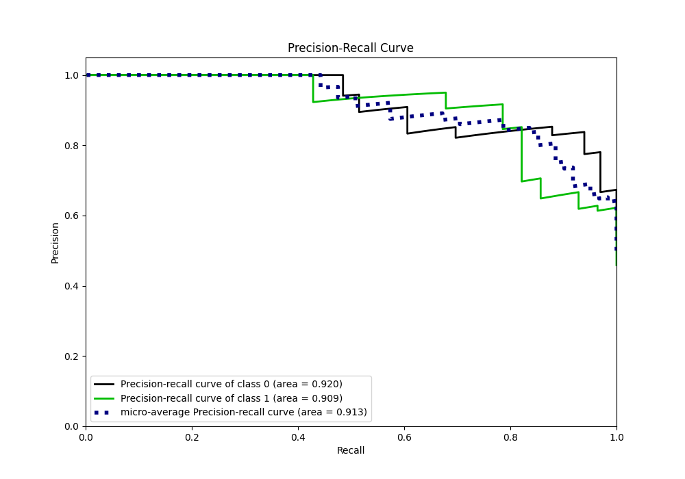
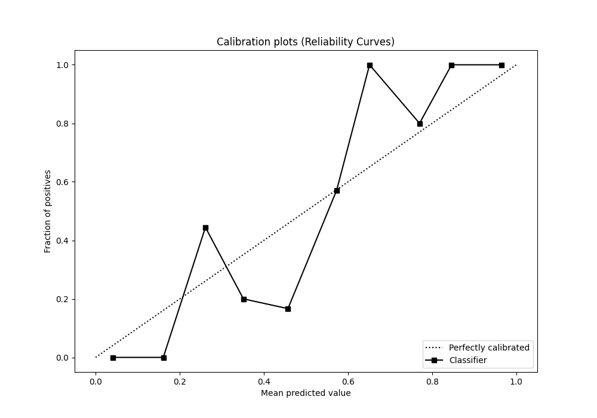
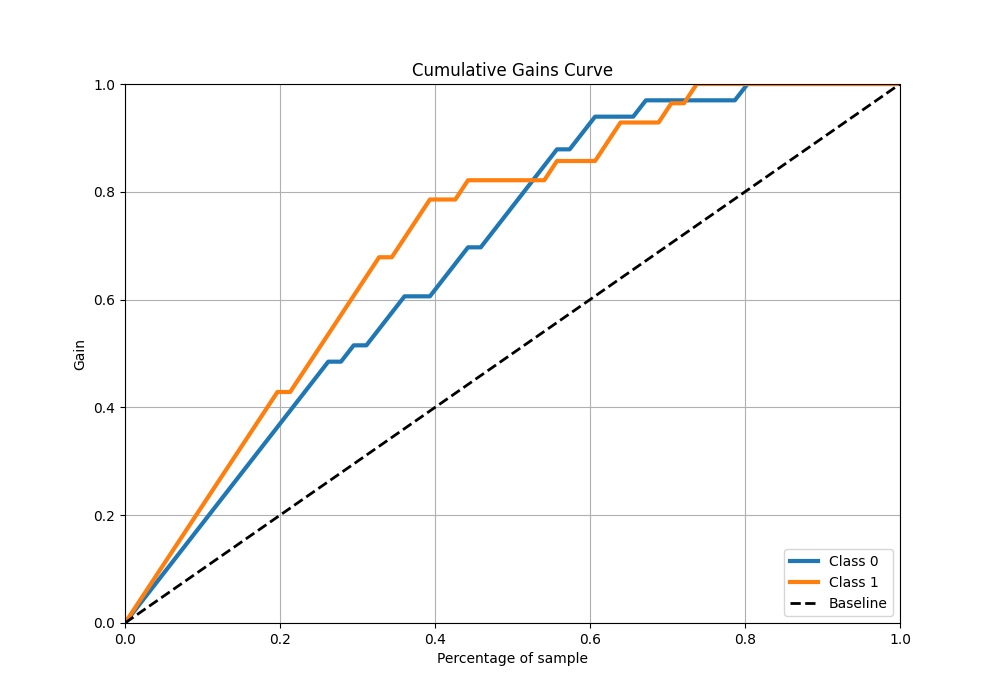
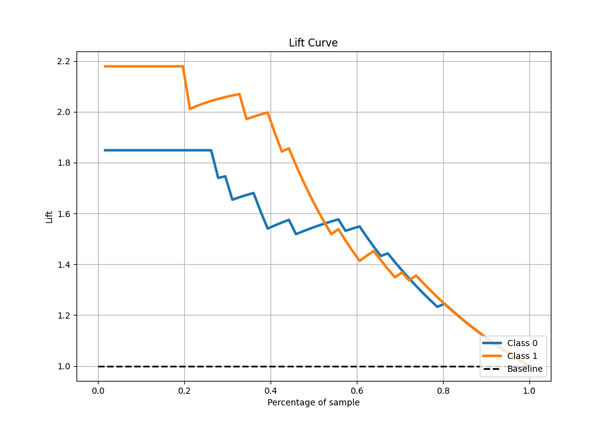

# Summary of 6_Default_RandomForest

[<< Go back](../README.md)

## Random Forest
- **n_jobs**: -1
- **criterion**: gini
- **max_features**: 0.9
- **min_samples_split**: 30
- **max_depth**: 4
- **eval_metric_name**: auc
- **explain_level**: 2

## Validation
 - **validation_type**: split
 - **train_ratio**: 0.75
 - **shuffle**: True
 - **stratify**: True

## Optimized metric
auc

## Training time

3.1 seconds

## Metric details
|           |    score |   threshold |
|:----------|---------:|------------:|
| logloss   | 0.407523 | nan         |
| auc       | 0.906926 | nan         |
| f1        | 0.846154 |   0.563854  |
| accuracy  | 0.868852 |   0.563854  |
| precision | 1        |   0.779616  |
| recall    | 1        |   0.0414953 |
| mcc       | 0.73966  |   0.563854  |

## Metric details with threshold from accuracy metric
|           |    score |   threshold |
|:----------|---------:|------------:|
| logloss   | 0.407523 |  nan        |
| auc       | 0.906926 |  nan        |
| f1        | 0.846154 |    0.563854 |
| accuracy  | 0.868852 |    0.563854 |
| precision | 0.916667 |    0.563854 |
| recall    | 0.785714 |    0.563854 |
| mcc       | 0.73966  |    0.563854 |

## Confusion matrix (at threshold=0.563854)
|              |   Predicted as 0 |   Predicted as 1 |
|:-------------|-----------------:|-----------------:|
| Labeled as 0 |               31 |                2 |
| Labeled as 1 |                6 |               22 |

## Learning curves

## Permutation-based Importance

## Confusion Matrix

## Normalized Confusion Matrix

## ROC Curve

## Kolmogorov-Smirnov Statistic

## Precision-Recall Curve

## Calibration Curve

## Cumulative Gains Curve

## Lift Curve

[<< Go back](../README.md)
