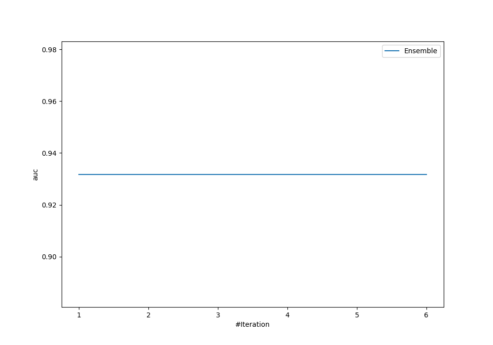
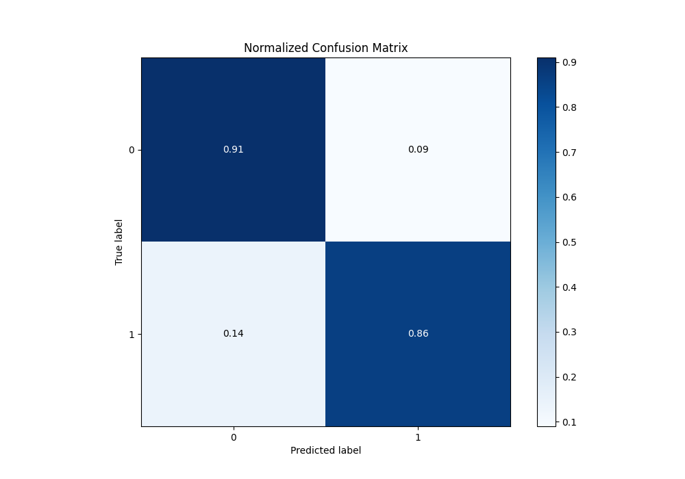
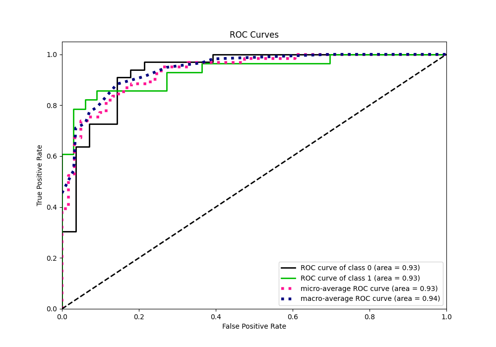
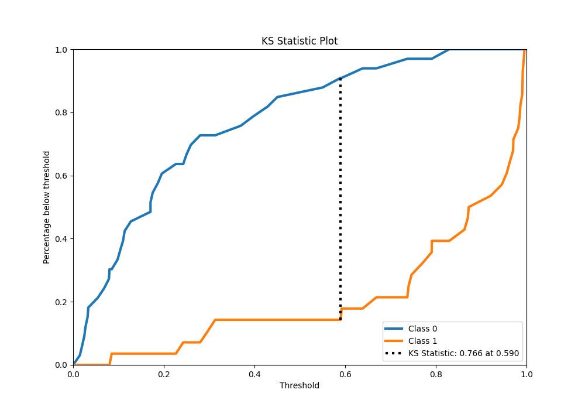
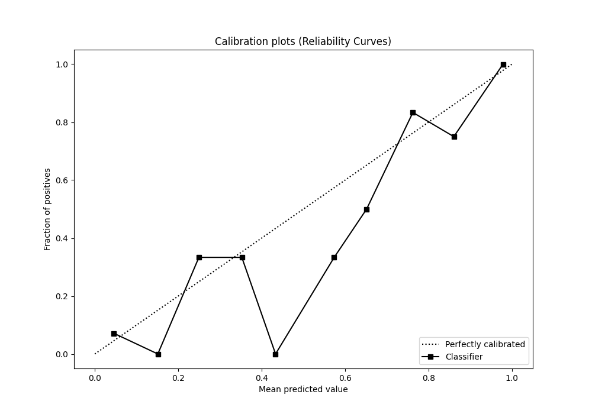
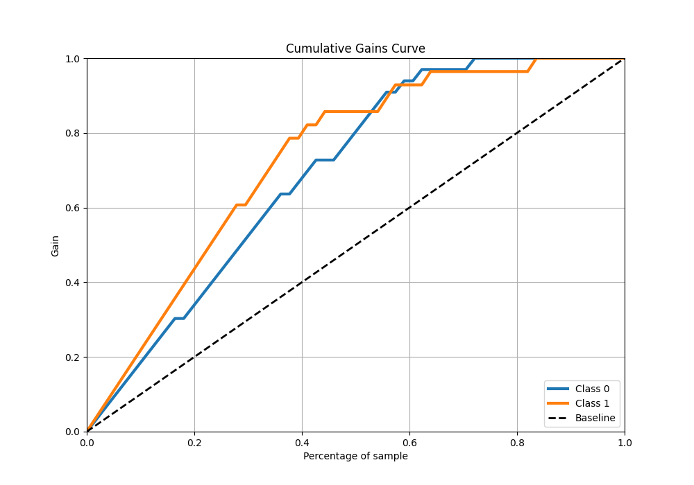

# Summary of Ensemble

[<< Go back](../README.md)

## Ensemble structure
| Model    |   Weight |
|:---------|---------:|
| 3_Linear |        1 |

## Metric details
|           |    score |   threshold |
|:----------|---------:|------------:|
| logloss   | 0.334924 | nan         |
| auc       | 0.931818 | nan         |
| f1        | 0.872727 |   0.591134  |
| accuracy  | 0.885246 |   0.591134  |
| precision | 1        |   0.846318  |
| recall    | 1        |   0.0133119 |
| mcc       | 0.776719 |   0.738523  |

## Metric details with threshold from accuracy metric
|           |    score |   threshold |
|:----------|---------:|------------:|
| logloss   | 0.334924 |  nan        |
| auc       | 0.931818 |  nan        |
| f1        | 0.872727 |    0.591134 |
| accuracy  | 0.885246 |    0.591134 |
| precision | 0.888889 |    0.591134 |
| recall    | 0.857143 |    0.591134 |
| mcc       | 0.768734 |    0.591134 |

## Confusion matrix (at threshold=0.591134)
|              |   Predicted as 0 |   Predicted as 1 |
|:-------------|-----------------:|-----------------:|
| Labeled as 0 |               30 |                3 |
| Labeled as 1 |                4 |               24 |

## Learning curves

## Confusion Matrix

## Normalized Confusion Matrix

## ROC Curve

## Kolmogorov-Smirnov Statistic

## Precision-Recall Curve

## Calibration Curve

## Cumulative Gains Curve

## Lift Curve

[<< Go back](../README.md)
