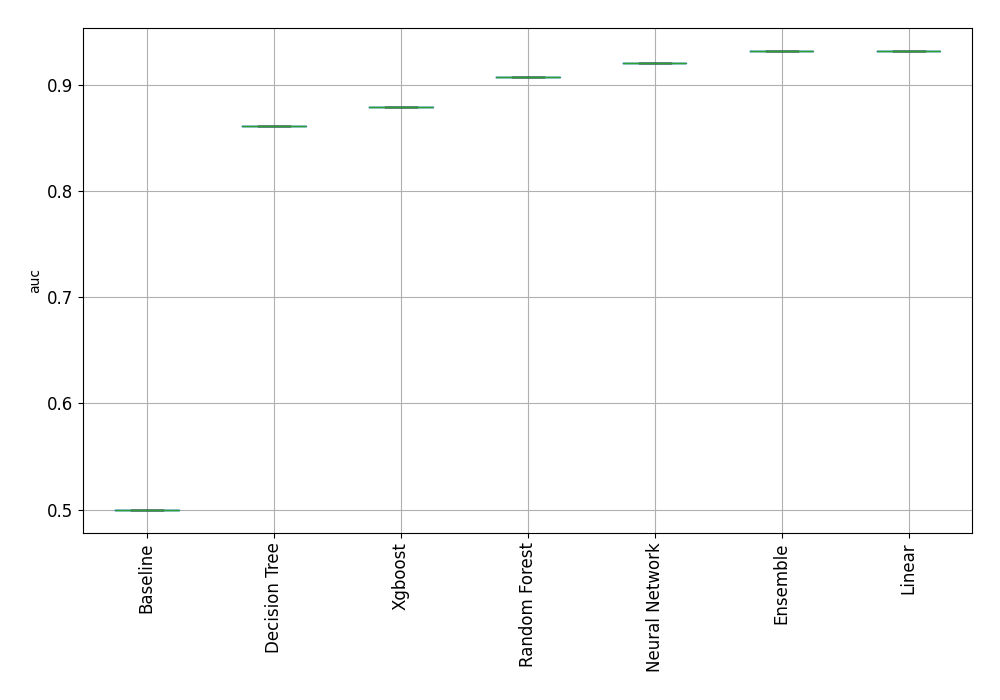

# Prediksi Penyakit Jantung menggunakan Automated Machine Learning

Repositori ini berisi kode dan hasil eksperimen untuk mengklasifikasikan indikasi penyakit jantung berdasarkan data rekam medis pasien. Proyek ini mengimplementasikan pendekatan **Automated Machine Learning (AutoML)** menggunakan *library* `mljar-supervised` untuk menemukan dan mengoptimalkan model algoritma terbaik secara otomatis.

## Informasi Dataset
Data yang digunakan diambil secara langsung dari [UCI Machine Learning Repository - Heart Disease Dataset (ID: 45)](https://archive.ics.uci.edu/dataset/45/heart+disease).
* **Total Data:** 303 baris data rekam medis.
* **Fitur (X):** 13 variabel klinis seperti `age` (usia), `chol` (kolesterol serum), `trestbps` (tekanan darah istirahat), dan `cp` (tipe nyeri dada).
* **Target (y):** Kolom `num` yang menunjukkan diagnosis penyakit jantung. Pada proyek ini, target disesuaikan menjadi klasifikasi biner:
  * `0`: Tidak ada indikasi penyakit jantung.
  * `1`: Terdapat indikasi penyakit jantung.

## Pipeline
1. **Pengumpulan Data:** Menggunakan pustaka `ucimlrepo` untuk menarik data langsung dari server UCI.
2. **Pra-pemrosesan Data:**
   * **Imputasi:** Menangani *missing values* menggunakan nilai tengah (`Median`) agar lebih tahan terhadap pencilan (*outlier*).
   * **Normalisasi:** Menggunakan `StandardScaler` untuk menyamakan rentang skala antar fitur medis (misalnya, menyeimbangkan skala kolesterol yang bernilai ratusan dengan skala tipe nyeri dada yang bernilai 1-4).
   * **Split Data:** Pembagian data latih (*training*) dan data uji (*testing*) dengan rasio 80:20 menggunakan parameter `stratify` untuk menjaga keseimbangan kelas.
3. **Pemodelan AutoML:** Menggunakan `mljar-supervised` dengan mode `"Explain"` dan metrik evaluasi `"auc"`.

## Hasil Pemodelan dan Evaluasi

Proses AutoML menguji coba dan melatih berbagai algoritma dasar hingga ansambel (*Baseline, Decision Tree, Random Forest, XGBoost, Neural Network, Linear, dan Ensemble*).

### Papan Peringkat Model (Leaderboard)
Berikut adalah cuplikan hasil performa berdasarkan nilai metrik **AUC (Area Under the ROC Curve)**:

| Rank | Nama Model | Tipe Algoritma | Nilai AUC | Waktu Training (detik) |
|:---:|:---|:---|---:|---:|
| **1** | **[3_Linear](AutoML_1/3_Linear/README.md)** | **Linear** | **0.931818** | 4.19 |
| 2 | [Ensemble](AutoML_1/Ensemble/README.md) | Ensemble | 0.931818 | 1.43 |
| 3 | [5_Default_NeuralNetwork](AutoML_1/5_Default_NeuralNetwork/README.md) | Neural Network | 0.919913 | 2.47 |
| 4 | [6_Default_RandomForest](AutoML_1/6_Default_RandomForest/README.md) | Random Forest | 0.906926 | 3.91 |
| 5 | [4_Default_Xgboost](AutoML_1/4_Default_Xgboost/README.md) | Xgboost | 0.878788 | 4.26 |

*Catatan: Meskipun model `Ensemble` memiliki nilai AUC yang sama persis dengan model `Linear`, AutoML menobatkan model **Linear** sebagai model terbaik ("The Best"). Hal ini selaras dengan prinsip kemudahan interpretasi dalam ranah medis, di mana algoritma yang lebih sederhana (*Linear*) lebih disukai jika performanya setara dengan model yang kompleks (*Ensemble*).*

### Visualisasi Performa
```pip install mljar-supervised ucimlrepo scikit-learn pandas matplotlib```

Distribusi performa seluruh model yang dievaluasi dapat dilihat pada grafik *boxplot* berikut:



### Evaluasi Model Terbaik (Linear)
Model Linear terpilih mampu mendeteksi indikasi penyakit jantung dengan tingkat akurasi dan *recall* yang sangat tinggi. Berikut adalah *Confusion Matrix* yang menunjukkan rasio tebakan benar vs salah dari model pada data uji:


